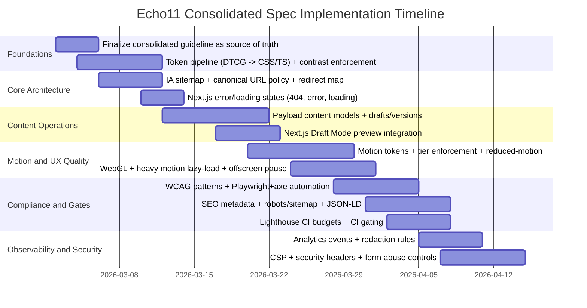

# Echo11 Industrial Development Guideline

## Executive Summary

This document consolidates the two uploaded design documents into a single, **production-ready, testable specification** for building a premium, smooth, fully animated marketing website in the aesthetic orbit of the referenced best-in-class sites. It resolves conflicts between (a) the philosophical/experiential guidance (Doc A) and (b) the tokenized, page-by-page build spec (Doc B), transforming them into a **single source of truth** with enforceable acceptance tests, CI gates, and operational workflows. fileciteturn0file0 fileciteturn0file1

The consolidated spec makes these non-negotiable decisions:

- **Architecture is Next.js App Router**, because Doc B explicitly assumes it (routes, file structure, page transitions, and performance budgets), and the deliverables (SEO metadata, sitemap/robots, error boundaries, Draft Mode) are best supported there. fileciteturn0file1  
- **Tokens are canonicalized as Doc B’s CSS variable system** (colors/typography/spacing/radius/shadows), then upgraded with additional semantic tokens and WCAG-driven guardrails. fileciteturn0file1  
- **Motion is governed by tokens + tiers**: Doc B’s tier model becomes enforceable; Doc A’s “compiled app” feel becomes measurable through responsiveness and motion constraints. fileciteturn0file0 fileciteturn0file1  
- **Performance targets are enforceable via Lighthouse CI** gates, aligned with Core Web Vitals thresholds and the stricter internal budgets specified in Doc B. fileciteturn0file1 citeturn13search0turn13search7turn0search1turn0search0  
- **Accessibility is WCAG 2.2 AA with explicit ARIA/keyboard patterns** and automated checks; Doc B’s “AA minimum” becomes a test suite and checklist. fileciteturn0file1 citeturn0search9turn16search1turn1search4  

Key risks removed by this consolidation:

- Ambiguity about routes, tokens, and transitions is replaced with canonical files, schemas, and acceptance tests (e.g., `app/robots.ts`, `app/sitemap.ts`, `not-found.js`, `error.js`, metadata `alternates.canonical`). citeturn3search0turn3search2turn14search0turn14search1turn7view0  
- Licensing/tooling risk around advanced animation plugins is made explicit and mitigated (procure or redesign). fileciteturn0file1 citeturn10search1  
- Missing operational specs (editorial workflow, preview, analytics taxonomy, privacy redaction, third-party governance, security headers/CSP) are defined as “MUST” requirements with verification steps. citeturn1search0turn2search11turn2search3turn15search0turn10search3  

## Unspecified Assumptions and Consolidation Principles

### Unspecified items (explicitly not assumed)

The following are **intentionally unspecified** and must be supplied by the product owner; where they affect implementation, this guideline gives safe defaults but flags them as configurable:

| Item | Status | Why it matters |
|---|---|---|
| Target audience / ICP | Unspecified | Determines IA emphasis, terminology, proof types, and conversion path density |
| Budget and licensing constraints | Unspecified | Determines viability of paid motion tooling and asset procurement fileciteturn0file1 |
| Hosting constraints | Unspecified | Affects caching strategy, edge usage, and security header delivery citeturn15search1turn15search17 |
| Supported locales | Unspecified (default single-locale) | Changes routing, hreflang, CMS localization, and QA matrix citeturn9search0turn9search2turn7view0 |
| Compliance scope | Unspecified | Impacts cookie consent, retention, PII handling, and legal pages |

### Consolidation principles

**Single source of truth:** Doc B becomes the canonical baseline for tokens, page skeleton, and performance targets; Doc A becomes the canonical baseline for experiential quality (“compiled” feel, anti-template constraints, and depth/lighting philosophy). fileciteturn0file0 fileciteturn0file1

**Normative language:** In this guideline,  
- **MUST** = required to ship,  
- **SHOULD** = required unless a documented exception exists,  
- **MAY** = optional enhancement.

**Testability first:** Any requirement that cannot be tested is rewritten into a measurable constraint (e.g., “premium smooth” → INP targets, animation concurrency rules, and FPS guardrails). citeturn0search0turn0search4turn13search3  

## Information Architecture and Content Operations

### Information architecture (sitemap, routes, error states, canonical URLs)

**Canonical route set (public):**

| Route | Purpose | Canonical URL policy | Primary CTA |
|---|---|---|---|
| `/` | Brand + positioning + proof | Canonical self | “Book a call” / “Start a project” fileciteturn0file1 |
| `/services` | Service offerings, process | Canonical self | “Request proposal” fileciteturn0file1 |
| `/work` | Case studies list | Canonical self | “View case study” fileciteturn0file1 |
| `/work/[slug]` | Case study detail | Canonical = slug URL; redirect old slugs | “Contact / Start” |
| `/pricing` | Packages + comparison | Canonical self | “Choose plan / Talk to advisor” fileciteturn0file1 |
| `/about` | Team/story/values | Canonical self | “Work with us” fileciteturn0file1 |
| `/contact` | Form + scheduling | Canonical self | Form submit fileciteturn0file1 |
| `/privacy` | Legal | Canonical self | N/A fileciteturn0file1 |
| `/terms` | Legal | Canonical self | N/A fileciteturn0file1 |
| `/accessibility` | Accessibility statement | Canonical self | N/A fileciteturn0file1 |

**Error and edge states (MUST):**
- Global 404: implement `global-not-found.js` or an equivalent global pattern; segmented 404 via `not-found.js` for content routes that depend on CMS data. citeturn14search0turn14search21  
- Runtime error boundary per route segment via `error.js`, with a global fallback via `global-error` when appropriate. citeturn14search1turn14search9  
- Loading UI for streaming segments via `loading.js` with skeletons that do **not** shift layout (CLS protection). citeturn14search3turn0search1  

**Canonical URLs and alternates (MUST):**
- Root `metadataBase` MUST be set so URL-based metadata can resolve consistently and avoid build errors when using relative URLs. citeturn5view0  
- Each route MUST set `alternates.canonical` (absolute or relative). Next.js supports this in the Metadata API and emits `<link rel="canonical">`. citeturn7view0turn3search16turn3search2  
- If locales are enabled later, “alternates.languages” MUST generate full hreflang sets including self-references; otherwise Lighthouse/Google guidance indicates hreflang may be ignored. citeturn7view0turn9search2turn9search9  

**Redirects (MUST):**
- Slug changes MUST use permanent redirects (308) at the platform edge or via Next.js redirect mechanisms (redirect map preferred for scale). citeturn3search4  
- UTM URLs MUST canonicalize to clean URLs (canonical tag must exclude tracking params).

**Acceptance tests (IA):**
- Visiting an unknown path returns the branded 404 UI (global not found). citeturn14search0  
- Removing a CMS case study causes `/work/[slug]` to render the segment `not-found.js` (not a blank page). citeturn14search21  
- Every routable page emits canonical `<link rel="canonical" ...>` in `<head>`. citeturn7view0turn3search16  
- Redirects: requesting an old slug returns 308 to the new slug (no 200-body soft redirect). citeturn3search4  

### Content strategy (types, editorial workflow, preview, metadata)

**Content types (MUST)**
Define content as structured data, not hard-coded sections. Minimum content model:

- **Site settings (singleton)**: brand name, tagline, primary CTA labels/URLs, social links, default SEO values, OG image fallback.
- **Services**: title, short pitch, long description blocks, “proof” references, deliverables list, CTA.
- **Work / case studies**: slug, title, summary, hero media, metrics, problem/approach/outcome narrative, stack tags, testimonial references.
- **Testimonials**: quote, author name, role, company, optional avatar/logo.
- **Pricing plans**: plan id, price, billing cadence, features list, “best for”, “limitations”.
- **Legal pages**: content blocks with last updated date.
- **Navigation**: header and footer link groups (supports future i18n variants).

Doc B already implies these pages and content blocks; this spec formalizes them as maintainable content types. fileciteturn0file1  

**Editorial workflow (MUST if CMS is used):**
- Draft + publish workflow MUST exist for all marketing-critical collections and globals. Payload’s Drafts feature builds on Versions and enables preview environments for draft content. citeturn2search1turn2search4  
- Roles (minimum): Admin, Editor, Reviewer/Publisher. Payload supports code-defined access control patterns. citeturn2search2turn2search5  

**Preview (MUST):**
- Preview MUST be implemented using Next.js Draft Mode; enabling/disabling Draft Mode MUST be via a secured Route Handler calling `draftMode().enable()` and is readable in Server Components via `draftMode().isEnabled`. citeturn1search0turn1search1  
- CM S “Preview” links MUST include a signed token and target the same route as production (no separate preview route), to avoid canonical/SEO divergence.

Example Route Handler (Draft Mode enable/disable):

```ts
// app/api/draft/route.ts
import { draftMode } from 'next/headers';

export async function GET(req: Request) {
  const { searchParams } = new URL(req.url);
  const secret = searchParams.get('secret');
  const slug = searchParams.get('slug') ?? '/';

  if (secret !== process.env.DRAFT_SECRET) {
    return new Response('Invalid secret', { status: 401 });
  }

  const draft = await draftMode();
  draft.enable();

  return Response.redirect(new URL(slug, req.url));
}
```

citeturn1search1turn1search0  

**Metadata requirements (MUST):**
- Every content type MUST include SEO fields: `title`, `description`, `ogImage`, `noindex` flag (for drafts/private), and canonical override only when necessary.
- Every page MUST have a unique `<title>` and description; root defaults inherit via parent metadata patterns.

**Acceptance tests (content/preview):**
- Editing a draft record and opening preview shows draft content without redeploy. citeturn1search0turn2search1  
- Draft Mode cookie is set only after valid secret access; invalid secret returns 401. citeturn1search1  

## Design System and Component Library

### Visual design tokens (canonical) and WCAG contrast enforcement

Doc B provides a coherent dark-mode token baseline; Doc A provides rationale for dark-mode depth, restraint, and perceived quality. fileciteturn0file1 fileciteturn0file0

**Canonical color tokens (MUST):**
- Use Doc B’s palette as `:root` CSS variables; treat them as immutable API. fileciteturn0file1  
- Add semantic aliases to prevent misuse (e.g., `--text-primary` → `--text`).

**Contrast outcomes (measured against WCAG 2.x contrast intent):**
WCAG contrast minimum guidance for readable text is defined in the WCAG understanding documents; this spec enforces AA as minimum, with AAA targeted where possible. citeturn0search6turn0search9  

Measured contrasts for Doc B’s tokens (key pairings):

| Foreground token | Background | Contrast ratio | AA (normal text) | AAA (normal text) |
|---|---|---:|---|---|
| `--text` `#F2F7FF` | `--bg` `#050709` | 18.76 | Pass | Pass |
| `--text-2` `#CBD5E1` | `--bg` `#050709` | 13.59 | Pass | Pass |
| `--muted` `#8B98A9` | `--bg` `#050709` | 6.88 | Pass | Fail |
| `--ghost` `#4A5568` | `--bg` `#050709` | 2.68 | Fail | Fail |
| `--accent` `#38BDF8` | `--bg` `#050709` | 9.42 | Pass | Pass |
| `--accent-dim` `#1E8FC4` | `--bg` `#050709` | 5.55 | Pass | Fail |

These ratios require immediate guardrails: **`--ghost` MUST NOT be used for any essential text**, and `--muted`/`--accent-dim` MUST be restricted to non-body contexts unless large-text rules apply. fileciteturn0file1 citeturn0search6turn0search9  

**Non-text contrast (UI boundaries) enforcement:**
WCAG 2.2 SC 1.4.11 requires at least 3:1 for essential UI component boundaries and graphical objects. citeturn0search9turn0search2  

Doc B’s border tokens are intentionally subtle (premium “hairline” feel), but they do not meet 3:1 against the darkest surfaces:

| Token | vs `--bg` contrast | vs `--surface` contrast | Pass 1.4.11 (3:1) |
|---|---:|---:|---|
| `--line` | 1.32 | 1.24 | No |
| `--line-mid` | 1.58 | 1.48 | No |
| `--line-strong` | 2.03 | 1.90 | No |

**Resolution (MUST):**
- Keep `--line*` tokens for **decorative rhythm only** (Doc B’s separators). fileciteturn0file1  
- Introduce a new semantic token `--ui-border` for interactive control boundaries with ≥3:1 contrast, e.g.:

```css
:root {
  --ui-border: #42618E; /* meets 3:1 against bg + surface */
}
```

This preserves Doc B’s visual restraint while satisfying 1.4.11 in places where boundaries communicate affordance. citeturn0search9turn0search2  

### Typography, spacing, grid, and responsive rules (testable)

Doc B defines the workable type system and spacing scale; this spec turns them into enforcement rules. fileciteturn0file1

**Typography (MUST):**
- Use Doc B’s tokenized scale and weights only (no ad-hoc font sizes/weights). fileciteturn0file1  
- Body text MUST use `--text-base` or larger on mobile to avoid density/legibility regressions.

Example canonical variables (excerpted pattern):

```css
:root {
  --font-sans: 'Geist', system-ui, -apple-system, sans-serif;
  --font-mono: 'Geist Mono', 'JetBrains Mono', monospace;

  --text-d1: clamp(52px, 6.5vw, 96px);
  --text-h2: clamp(28px, 3vw, 44px);
  --text-base: clamp(15px, 1.2vw, 17px);

  --leading-tight: 1.1;
  --leading-normal: 1.55;
}
```

fileciteturn0file1  

**Spacing (MUST):**
- Base spacing unit is 8px grid (Doc B); only token values may be used for padding/margins/gaps. fileciteturn0file1  
- Section rhythm MUST use Doc B’s section tokens (`--section-sm` ... `--section-xl`) to create deliberate density changes.

**Shape language (MUST):**
- Border radius is capped (Doc B) to protect “technical sharpness”; use `--radius-3` (4px) as default component radius; `--radius-4` (6px) is reserved for large panels only. fileciteturn0file1  
- Doc A’s anti-template aesthetic is enforced via composition rules (no repeated identical scaffolds and no generic cards). fileciteturn0file0  

**Grid and layout (MUST):**
- Desktop layout uses a 12-column grid and asymmetrical splits as defined; mobile collapses to single column with controlled “full bleed” breakouts to maintain premium rhythm. fileciteturn0file1  
- Section scaffolding rule: do not repeat the same content scaffold twice consecutively (Doc B). fileciteturn0file1  

### Component library and token export formats

**Token source of truth (MUST):**
- Tokens MUST be stored in a tool-agnostic format (DTCG spec) and compiled to CSS vars, TS types, and optional JSON for runtime theming. The Design Tokens Format Module defines an exchange format for tokens across tools. citeturn11search17turn11search6  

Recommended structure:

```txt
tokens/
  echo11.tokens.json      // DTCG format
src/styles/
  tokens.css              // compiled CSS vars
  tokens.ts               // compiled TS map + types
```

citeturn11search17turn11search1  

**Figma mapping (SHOULD):**
- Figma Variables SHOULD map 1:1 to the semantic token set and be exported into the token pipeline, because Variables are explicitly intended for tokenizing design decisions and scaling design systems. citeturn11search14  

**Component inventory (MUST):**
Doc B implies a strong component set (header, chassis panels, segmented controls, CmdK palette, etc.) and a specialized interaction system. This guideline requires a full inventory including missing production primitives:

- Navigation: header, mobile nav, footer, breadcrumbs (if needed)
- Inputs: text, textarea, segmented radio-group, checkbox (if any), validation states
- Buttons: primary/secondary/ghost, icon button, loading state
- Content: hero, feature rail, metric chassis, testimonial module, pricing matrix, FAQ accordion
- Overlays: modal dialog, toast, CmdK palette
- Utilities: skeleton loaders, empty states

**ARIA patterns (MUST):**
- Segmented controls MUST use radio-group semantics (not a fake `div` set), following WAI-ARIA radio group pattern expectations. citeturn1search7turn1search3  
- Modal dialogs MUST trap focus and keep Tab order inside the dialog. citeturn1search1turn1search9  

### Developer handoff (specs, assets, code snippets)

**Handoff artifacts (MUST):**
- Figma file with: components, variants, constraints, variables/tokens, motion annotations (timing/easing), and redlines for layout and spacing tokens.
- Asset manifest: fonts, icons, illustrations, OG images, favicon set, with licensing notes.
- Component catalog: Storybook (or equivalent) with states and interaction notes.

**Acceptance tests (handoff completeness):**
- For every component, the Storybook stories cover: default, hover, focus-visible, disabled, loading, error (where relevant).
- For every page section, there is a defined component composition and token usage reference; no “magic numbers.”

image_group{"layout":"carousel","aspect_ratio":"16:9","query":["Vercel homepage dark UI typography spacing","Linear app redesign dark theme UI tokens","GitHub Primer design system color primitives accessibility","Raycast product page dark UI micro-interactions"] ,"num_per_query":1}

## Motion, Accessibility, and Responsive Behavior

### Motion design system (tokens, tiers, transitions, reduced motion, GPU/CPU guardrails)

Doc A defines the experiential bar (“compiled app” feel) and insists on high-fidelity motion; Doc B defines the tiered system and explicit transition patterns; this spec makes both enforceable. fileciteturn0file0 fileciteturn0file1

**Motion tokens (MUST):**
Define a motion token set used consistently across CSS transitions, motion library config, and GSAP timelines:

- Durations: `dur-1` 120ms, `dur-2` 180ms, `dur-3` 240ms, `dur-4` 350ms, `dur-5` 600ms  
- Easing (CSS):  
  - `ease-out-soft`: cubic-bezier(0.16, 1, 0.3, 1)  
  - `ease-out-snap`: cubic-bezier(0.2, 0.9, 0.2, 1)  
- Springs (JS): standard “responsive spring” parameters defined once and reused.

**Tier enforcement (MUST):** based on Doc B
- Tier 0 (always on): micro fades (200–300ms), focus ring transitions (≈180ms), button lift (≈150ms). fileciteturn0file1  
- Tier 1 (section reveals): staggered content reveal and chassis rise; total timelines 400–600ms. fileciteturn0file1  
- Tier 2 (signature): WebGL wave, SVG path draw, scroll-connected effects—strictly limited in surface area and conditionally disabled. fileciteturn0file1  

**Page transitions (MUST):**
Doc B prescribes a clip-path wipe pattern for navigation transitions, with an opacity-only fallback. Implementations MUST ensure transitions do not obscure focus, and MUST be disabled for reduced-motion. fileciteturn0file1  

Example variant pattern (conceptual):

```ts
export const pageTransition = {
  initial: { clipPath: 'inset(0 100% 0 0)', opacity: 1 },
  animate: { clipPath: 'inset(0 0% 0 0)', transition: { duration: 0.35 } },
  exit:    { clipPath: 'inset(0 0 0 100%)', transition: { duration: 0.25 } },
};
```

fileciteturn0file1  

**Reduced-motion (MUST):**
- If `prefers-reduced-motion: reduce`, all Tier 1–2 transforms MUST downgrade to **opacity-only** and all scroll-tied animation MUST be disabled or frozen (Doc B requirement). fileciteturn0file1  
- For WebGL background: freeze at a static frame and pause render loop via IntersectionObserver when offscreen (Doc B). fileciteturn0file1  

**Performance guardrails (MUST):**
- No “scroll-jacking” that blocks native scroll unless it still meets responsiveness requirements and provides reduced-motion fallback, because scroll-jacking is a high-risk usability/accessibility regression unless carefully constrained. fileciteturn0file1 citeturn0search0  
- Heavy libraries (Three.js / large motion bundles) MUST be lazy-loaded and code-split; Next.js recommends lazy loading Client Components and libraries to reduce initial JS. fileciteturn0file1 citeturn2search12  

**Motion acceptance tests:**
- With reduced-motion enabled, page transitions become opacity-only and no scroll-tied animation runs.  
- CPU guard: WebGL render loop pauses when canvas is not intersecting viewport.  
- Interaction responsiveness meets INP thresholds in field and CI baselines. citeturn0search0turn0search8  

### Accessibility (WCAG 2.2 AA) and interaction semantics

Doc B sets WCAG targets; this spec turns them into precise acceptance criteria. fileciteturn0file1 citeturn0search9  

**WCAG 2.2 AA acceptance criteria (MUST):**
- Text contrast meets minimum contrast requirements; UI component boundaries meet SC 1.4.11 where boundaries indicate affordance. citeturn0search9turn0search6turn0search2  
- All interactive components are keyboard operable; focus order is logical. fileciteturn0file1  
- Focus-visible: Doc B requires a 2px accent offset ring; this MUST be implemented with robust contrast and must not be disabled. fileciteturn0file1  
- Touch target minimum 44×44 CSS px on mobile (Doc B). fileciteturn0file1  

**ARIA and keyboard patterns (MUST):**
- Buttons follow button pattern semantics. citeturn1search0  
- Modal dialogs trap focus; Tab/Shift+Tab stay inside; Escape closes; focus returns to trigger. citeturn1search1turn1search13  
- Tabs (if used) follow tablist/tabpanel roles and keyboard behavior. citeturn1search2turn1search6  
- Segmented controls use radio-group pattern, with arrow-key navigation inside and Tab entering/exiting group. citeturn1search7turn1search3  

**Automated accessibility testing (MUST):**
- E2E tests use Playwright, and automated checks use Axe integration for detectable violations; automated tests cannot detect all WCAG issues, so manual audits remain required. citeturn16search0turn16search1  

Example a11y scan test:

```ts
import { test, expect } from '@playwright/test';
import AxeBuilder from '@axe-core/playwright';

test('no critical a11y violations on homepage', async ({ page }) => {
  await page.goto('/');
  const results = await new AxeBuilder({ page }).analyze();
  expect(results.violations).toEqual([]);
});
```

citeturn16search1turn16search0  

### Responsiveness (breakpoint matrix and per-component behavior)

Doc B defines breakpoint tiers explicitly; this spec makes them a required matrix for every component. fileciteturn0file1  

**Breakpoint matrix (MUST):**
- Desktop: ≥1280px  
- Tablet: 768–1279px  
- Mobile: <768px  

Doc B also describes behavior changes at intermediate widths (e.g., nav collapses around ~1080px), which MUST be captured as component rules not ad-hoc media queries. fileciteturn0file1  

**Per-component responsive rules (MUST examples):**
- Header: desktop horizontal nav; tablet condenses; mobile hamburger with accessible dialog/panel semantics.
- Pricing matrix: desktop comparison table; tablet reduces columns; mobile becomes stacked plan cards with clear feature grouping.
- Work grid: desktop asymmetrical layout; tablet reduces density; mobile single column with full-bleed media breakouts (Doc B). fileciteturn0file1  

**Responsive acceptance tests (MUST):**
- No horizontal scroll at 320px width except intentional full-bleed sections that still preserve safe padding for text.
- CLS remains within budget when switching breakpoints and when fonts load.

## Engineering Quality, SEO, Analytics, Security, and Delivery Plan

### SEO and performance (Next.js metadata, JSON-LD per route, Lighthouse budgets and CI)

**Metadata (MUST):**
- Use Next.js Metadata API (`metadata` object or `generateMetadata`) for titles, descriptions, robots, Open Graph, Twitter cards, and canonical/alternates. citeturn3search4turn7view0  
- Configure `metadataBase` in root layout for URL composition and to avoid build errors on relative URL metadata. citeturn5view0  

Example root metadata:

```ts
// app/layout.tsx
import type { Metadata } from 'next';

export const metadata: Metadata = {
  metadataBase: new URL(process.env.SITE_URL ?? 'https://example.com'),
  title: { default: 'Echo11', template: '%s — Echo11' },
  description: 'Design-engineered web platforms for SaaS teams.',
  alternates: { canonical: '/' },
};
```

citeturn5view0turn7view0  

**robots and sitemap (MUST):**
- Implement `app/robots.ts` and `app/sitemap.ts` using Next.js metadata file conventions. citeturn3search0turn3search2  

**Structured data JSON-LD (MUST for SEO maturity):**
- Use Next.js JSON-LD guidance: render structured data as a `<script type="application/ld+json">` from `layout` or `page`. citeturn2search0turn2search8  
- Minimum schema per route:
  - `/`: `Organization` + `WebSite`
  - `/services`: `Service` (or `ItemList` of services)
  - `/work/[slug]`: `CreativeWork`/`CaseStudy`-like representation
  - `/pricing`: `Product`/`Offer` representation if pricing is strict; otherwise omit Product schema and use FAQPage where appropriate.
  - `/about`: `Organization` + `Person` (team) if appropriate.

Example JSON-LD snippet:

```tsx
const jsonLd = {
  '@context': 'https://schema.org',
  '@type': 'Organization',
  name: 'Echo11',
  url: 'https://example.com',
};

export function JsonLd() {
  return (
    <script
      type="application/ld+json"
      dangerouslySetInnerHTML={{ __html: JSON.stringify(jsonLd) }}
    />
  );
}
```

citeturn2search0turn2search8  

**Performance budgets (MUST)**
Doc B sets aggressive targets: LCP < 1.8s, INP < 150ms, CLS = 0.00, initial JS < 80KB gzip, and lazy-loading of heavy libraries. fileciteturn0file1  
Core Web Vitals “good” thresholds are broader (e.g., LCP ≤ 2.5s, INP ≤ 200ms at p75), so Doc B’s targets are **stricter-than-standard** and acceptable as premium internal budgets. citeturn0search1turn0search0  

**Lighthouse CI gating (MUST):**
- Use Lighthouse CI to assert thresholds in CI; Lighthouse CI is designed to continuously run and assert against Lighthouse results over time. citeturn13search0turn13search7  
- CI MUST fail on regression beyond budgets, not on perfection; thresholds should be tuned to match reality while preventing backslides. citeturn13search0turn13search3  

### Analytics and measurement (event taxonomy, privacy/redaction)

**Baseline analytics (MUST):**
- Use Vercel Web Analytics for cookie-less baseline traffic insights; Vercel states it does not use third-party cookies and uses a request-derived hash for visitor identification. citeturn2search11turn2search7  

**Event taxonomy (MUST):**
Define a stable naming scheme and required properties:

| Event | When | Properties | Notes |
|---|---|---|---|
| `cta_click` | Any primary CTA | `cta_id`, `route`, `position` | Used for funnel attribution |
| `form_submit_attempt` | Contact submit clicked | `form_id` | No PII payloads |
| `form_submit_success` | Server accepted | `form_id`, `latency_ms` | Track reliability |
| `work_filter_change` | Changing filters | `filter_type`, `value` | Measure browsing behavior |
| `pricing_toggle` | Monthly/annual | `value` | Measures intent |

**Privacy and redaction (MUST):**
- Implement `beforeSend` redaction and drop events that contain sensitive URL patterns or query params; Vercel provides guidance for redacting sensitive data. citeturn2search3turn2search15  

### CMS/content workflow (models, preview, localization, roles)

**Content model and workflow (MUST if CMS-backed):**
- Payload Collections define schemas; each collection generates APIs for managing documents. citeturn2search13  
- Drafts + Versions enable draft previews and change history. citeturn2search1turn2search4  
- Roles and access control must be defined as code (Payload supports role-based patterns and collection/field-level restrictions). citeturn2search2turn2search5  

**Localization (MAY now, MUST if multi-locale):**
- Payload has a localization system; publication status can be localized for draft-enabled content (noting beta/experimental caveats). citeturn2search0turn2search6  
- If localization is enabled, editorial workflow must define translation ownership and publication readiness per locale.

### Internationalization (routing, hreflang, translation workflow)

**Routing (MUST if enabled later):**
- Use Next.js internationalization guidance for routing and localized content. citeturn9search0  
- If locale-prefixed routing is chosen, adopt a single consistent pattern (`/[locale]/...`) and ensure all special files (404/error/loading) are locale-aware.

**hreflang (MUST if multi-locale):**
- Google recommends hreflang to identify localized variations; Google does not use hreflang or `lang` to detect language but uses it to understand localized variants. citeturn9search2turn7view0  

### Security and privacy (CSP, cookies, forms, third-party governance, OWASP)

**Threat model scope (MUST):**
Even for a marketing site, the threat surface includes: contact forms, third-party scripts, preview endpoints, and CMS APIs.

**CSP (MUST):**
- Next.js explicitly recommends CSP to mitigate XSS/clickjacking/code injection risks and describes how to implement it. citeturn15search0  
- OWASP CSP guidance emphasizes defense-in-depth even when vulnerabilities exist. citeturn10search1  

**Security headers (MUST):**
- Configure response headers via `headers()` in `next.config.js`. citeturn15search1turn15search17  
- Use OWASP HTTP Headers cheat sheet as baseline for recommended headers. citeturn10search3turn10search13  

**Form abuse prevention (MUST):**
- Rate limiting and resource controls are required to prevent resource exhaustion and automated abuse; OWASP identifies missing/inappropriate limits as a vulnerability class and provides mitigation guidance. citeturn10search2turn10search6  
- Implement CSRF protection for any authenticated or stateful operations; OWASP provides a CSRF prevention cheat sheet. citeturn10search0turn10search4  
- Server errors must not leak internal details; OWASP guidance on REST error handling warns against revealing stack traces. citeturn10search12  

**Third-party governance (MUST):**
- Third-party scripts must be minimized and loaded intentionally; Next.js recommends including third-party scripts only in specific pages/layouts to reduce performance impact, and provides Script loading strategies. citeturn15search15turn2search6turn15search19  

## Comparison Tables, Prioritized Backlog, and Implementation Timeline

### How the consolidated spec resolves prior gaps

| Dimension | Gap in Doc A | Gap in Doc B | Resolution in this spec |
|---|---|---|---|
| IA + canonical URLs | Vision-first, no enforceable sitemap rules fileciteturn0file0 | Routes exist but canonical/redirect system not formalized fileciteturn0file1 | Canonical policy via `metadataBase` + `alternates.canonical`, redirect rules, error state conventions citeturn5view0turn7view0turn3search4turn14search0 |
| Content strategy | No editorial workflow/preview model fileciteturn0file0 | Page copy patterns but missing CMS workflow fileciteturn0file1 | Content models + Draft Mode preview + drafts/versions workflow citeturn1search1turn2search1turn2search13 |
| Visual tokens | Some guidance, not standardized fileciteturn0file0 | Tokens exist but misuse risk (ghost text, low-contrast borders) fileciteturn0file1 | Token guardrails with WCAG contrast tables + new semantic tokens for UI boundaries citeturn0search9turn0search6turn0search2 |
| Motion | Philosophical excellence, weak measurement fileciteturn0file0 | Good tiers but incomplete enforcement + tool risk fileciteturn0file1 | Motion tokens + reduced-motion contract + lazy-load enforcement + CI perf gates citeturn2search12turn13search0turn0search0turn0search1 |
| Accessibility | Implicit | High-level AA target, lacks acceptance tests fileciteturn0file1 | WCAG 2.2 AA test suite, ARIA patterns, Playwright+axe automation citeturn0search9turn1search4turn16search1 |
| SEO + structured data | Not defined | Targets but no complete metadata/sitemap/JSON-LD plan fileciteturn0file1 | Next.js metadata + robots/sitemap + JSON-LD per route citeturn3search0turn3search2turn2search0turn7view0 |
| Analytics + privacy | Not defined | Mentioned but not operational fileciteturn0file1 | Event taxonomy + beforeSend redaction + cookie-less baseline citeturn2search11turn2search3turn2search7 |
| Security | Minimal | Minimal | CSP + headers + rate limiting + CSRF guidance + third-party governance citeturn15search0turn10search3turn10search6turn10search0turn2search6 |

### Prioritized backlog (actionable fixes with effort and impact)

Effort is rough-order-of-magnitude for a small team (1–2 engineers + design support). “Impact” is on perceived premium quality + risk reduction.

| ID | Area | Work item | Priority | Effort | Impact |
|---|---|---|---|---:|---|
| IA-1 | IA | Implement canonical sitemap + route map, include `/work/[slug]` and error states | High | 2–4d | High |
| IA-2 | IA | Add redirects strategy + slug-change map | High | 1–3d | High |
| CS-1 | Content | Define Payload content models for core collections | High | 3–6d | High |
| CS-2 | Content | Implement Draft Mode preview + secured secret flow | High | 2–4d | High |
| DS-1 | Visual | Token pipeline in DTCG format → CSS/TS outputs | High | 3–7d | High |
| DS-2 | Visual | WCAG contrast enforcement + add `--ui-border` token | High | 1–2d | High |
| MD-1 | Motion | Formalize motion tokens + tier rules + reduced motion fallbacks | High | 3–6d | High |
| MD-2 | Motion | Lazy-load heavy motion/WebGL + pause offscreen | High | 2–5d | High |
| AX-1 | A11y | ARIA semantics for segmented controls, dialogs, tabs | High | 2–4d | High |
| AX-2 | A11y | Playwright+axe automation in CI | High | 2–4d | High |
| SEO-1 | SEO | Metadata (`metadataBase`, canonical, OG), robots/sitemap files | High | 2–4d | High |
| SEO-2 | SEO | JSON-LD schema per route | Medium | 2–5d | Medium |
| PERF-1 | Perf | Lighthouse CI setup + assertion budgets | High | 2–4d | High |
| PERF-2 | Perf | Bundle discipline + dynamic import policy | Medium | 2–5d | High |
| AN-1 | Analytics | Event taxonomy + custom events wiring | Medium | 2–4d | Medium |
| AN-2 | Analytics | beforeSend redaction rules | Medium | 1–2d | Medium |
| SEC-1 | Security | CSP + security headers baseline | High | 2–5d | High |
| SEC-2 | Security | Form abuse controls (rate limiting, validation, logging) | High | 2–5d | High |
| I18N-1 | i18n | Locale readiness spec + hreflang strategy (if needed) | Low | 3–6d | Medium |

### Implementation timeline (starting 2026-03-02)



This schedule assumes the consolidated guideline is treated as an “API contract” and changes are managed via explicit revisions, because OWASP highlights that “insecure design” often stems from missing or ineffective control design rather than implementation defects. citeturn0search7turn0search14